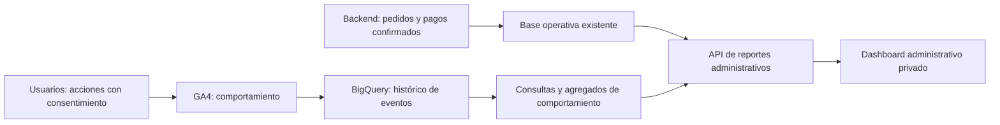

# Manual práctico de analítica para Zisify

Revisión: 2 de septiembre de 2026. Preparado con el código actual de usuarios. No se han modificado tu cuenta de GA4, su retención ni sus vinculaciones: los ajustes de consola siguientes son pasos por realizar.

## 1. Qué herramienta usar para cada pregunta

| Pregunta | Fuente recomendada |
| --- | --- |
| ¿Cuántas personas entraron y a qué páginas? | GA4 |
| ¿Qué botones tocaron? | Eventos `ui_click` de GA4 |
| ¿En qué paso abandonaron el checkout o pago? | Exploraciones de embudos de GA4 |
| ¿Qué porcentaje de una página recorrieron? | Requiere instrumentación adicional de profundidad de scroll |
| ¿Cuántos pedidos se pagaron, entregaron o cancelaron? | Base de datos del backend |
| ¿Cuánto se cobró y cuánto ingresó realmente a Zisify? | Pagos, devoluciones y comisiones confirmados en backend |
| ¿Cómo conservar años de comportamiento y combinarlo con ventas? | Exportación GA4 → BigQuery + datos del backend |

Mi recomendación es usar GA4 ahora para tus KPI de comportamiento, activar una exportación diaria a BigQuery para el histórico y construir el dashboard administrativo sobre datos de negocio del backend. No necesitas desarrollar una base de datos de clics desde cero para empezar.

## 2. Qué está implementado hoy

El frontend de usuarios usa `G-YEE37VXVQX`. Solo envía desde la compilación de producción en `zisify.com` y `www.zisify.com`, después de aceptar la analítica. No envía desde localhost ni desde los dominios de vista previa de Firebase. Revisa que estés en la propiedad que contiene ese flujo; un ID `G-…` identifica el flujo web, no el ID numérico de la propiedad.

| Evento existente | Qué significa | Detalle disponible |
| --- | --- | --- |
| `page_view` | Pantalla visitada | Ruta y título normalizados |
| `ui_click` | Clic en un control instrumentado | `button_id`, `screen_name` |
| `view_item` | Vista de un producto instrumentado | ID de producto, precio, cantidad |
| `add_to_cart` | Producto añadido al carrito | Datos del producto y moneda PEN |
| `view_cart` | Vista del carrito instrumentado | Productos y valor |
| `begin_checkout` | Inicio del checkout instrumentado | Productos y valor |
| `checkout_step_view` | Paso del checkout de comidas | `delivery`, `review`, `order_created` |
| `payment_step_view` | Paso del modal de pago | `1`, `2`, `3` |
| `order_created` | El backend aceptó crear el pedido | No acredita cobro |
| `payment_reported` | El usuario reportó el pago y la petición tuvo éxito | No acredita aprobación bancaria/administrativa |
| `flow_error` | Fallo en una operación del flujo | `flow_stage`, `http_status` |
| `pwa_update` | Acción del sistema de actualización de usuarios | `update_action` |

La cobertura más completa está en el flujo de comidas. No supongas que el flujo antiguo de licores tiene todos esos pasos. Tampoco todos los botones del sitio están instrumentados: se usa una lista explícita de acciones.

No se envía `purchase`, profundidad de scroll ni grabaciones de sesión. Las rutas de restaurantes se agrupan como `/food/restaurant/:id`; sirven para analizar esa pantalla, no para distinguir cada restaurante. No se envían teléfonos, direcciones, valores de formularios ni números de operación de pago.

## 3. Configuración inicial, una sola vez

1. Entra a [Google Analytics](https://analytics.google.com/) y selecciona la propiedad correcta.
2. Comprueba la zona horaria de los informes: usa Lima/Perú para comparar con el día operativo del backend. Usa PEN como moneda de presentación.
3. En **Administrador → Retención de datos** —puede estar dentro de Recogida y modificación de datos o Configuración de datos— selecciona **14 meses** y guarda. Necesitas permisos de Editor. Esto amplía lo que puedes consultar en exploraciones; no recupera datos ya borrados. Los informes agregados estándar no están sujetos a ese mismo ajuste. [Retención oficial](https://support.google.com/analytics/answer/7667196?hl=en).
4. En **Administrador → Flujos de datos → flujo web**, verifica el ID de medición. La guía técnica del proyecto pide desactivar la medición mejorada automática de este flujo: ya enviamos vistas manualmente. No actives el seguimiento automático de historial, búsquedas o formularios sin revisar duplicaciones y privacidad.
5. En **Administrador → Definiciones personalizadas → Crear dimensión personalizada**, crea estas dimensiones con ámbito **Evento**. Escribe el parámetro exactamente como aparece en la tabla. Registrar la dimensión no crea eventos ni reconstruye detalles históricos que no se recogieron. Su disponibilidad en informes puede tardar 24–48 horas. [Crear dimensiones](https://support.google.com/analytics/answer/14239696?hl=en), [disponibilidad](https://support.google.com/analytics/answer/14240153?hl=en).

| Nombre para mostrar | Parámetro |
| --- | --- |
| Botón | `button_id` |
| Pantalla Zisify | `screen_name` |
| Paso de checkout | `checkout_step` |
| Paso de pago | `payment_step` |
| Etapa del error | `flow_stage` |
| Estado HTTP | `http_status` |
| Acción de actualización | `update_action` |

Puedes marcar `order_created` y `payment_reported` como eventos clave para medir objetivos intermedios. Conserva sus nombres: no los conviertas en `purchase` ni los interpretes como ventas pagadas.

## 4. Ver un día, una semana o un mes

Abre un informe y usa el selector de fechas de la esquina superior derecha. Selecciona inicio y fin y pulsa Aplicar. Activa Comparar para contrastar otro intervalo. En gráficos compatibles puedes cambiar la granularidad entre día, semana y mes: cambiar el intervalo y cambiar la agrupación son operaciones distintas. [Fechas y comparaciones](https://support.google.com/analytics/answer/13412290?hl=en).

Ejemplos para tu rutina:

| Quiero revisar | Inicio | Fin |
| --- | --- | --- |
| Un día terminado | 01/09/2026 | 01/09/2026 |
| Una semana de lunes a domingo | 24/08/2026 | 30/08/2026 |
| Un mes completo | 01/08/2026 | 31/08/2026 |

Usa límites explícitos si tu semana comercial empieza el lunes; no asumas que todas las vistas de GA4 agrupan las semanas igual. Compara semanas completas con semanas completas. El día en curso todavía está incompleto.

En **Explorar**, el calendario está en la columna Variables. Cada exploración tiene su propio rango; cambiar las fechas de un informe no significa que cambien todas las exploraciones. [Exploraciones](https://support.google.com/analytics/answer/7579450).

**Usuarios no es lo mismo que visitas.** Una persona puede volver varias veces y generar muchos eventos. No sumes usuarios diarios para calcular usuarios únicos mensuales: consulta el mes completo. Usa la misma métrica —usuarios totales o activos— en tus comparaciones.

## 5. Informe: cuántos entraron y dónde estuvieron

Busca **Informes → Interacción → Páginas y pantallas**. Según la colección de informes de tu propiedad, puede aparecer bajo otro grupo; puedes buscarlo por nombre. Usa la dimensión Ruta de página y clase de pantalla o Título de página. Revisa usuarios, vistas y tiempo de interacción. Busca `/food/checkout`, `/food/cart` o `/food/restaurant/:id` para enfocarte en una pantalla. [Páginas y pantallas](https://support.google.com/analytics/answer/12926732?hl=en).

Para saber de dónde llegan, abre **Adquisición de tráfico** y compara fuente/medio de la sesión. Para comparar canales, separa móvil y escritorio: una caída de checkout que solo sucede en móvil sugiere una fricción específica de esa experiencia.

## 6. Informe: qué botones usan

Receta propuesta para tu implementación:

1. **Explorar → Formato libre**. Nombre: `Zisify — clics por pantalla`.
2. Importa dimensiones **Nombre del evento**, **Botón**, **Pantalla Zisify** y **Categoría de dispositivo**.
3. Importa métricas **Número de eventos** y **Usuarios totales**.
4. Pon Pantalla y Botón en Filas; Número de eventos y Usuarios totales en Valores.
5. Filtra Nombre del evento **coincide exactamente con** `ui_click`.
6. Cambia las fechas para obtener el reporte diario, semanal o mensual. Opcionalmente pon dispositivo en Columnas.

Acciones útiles: `dish_add_to_cart`, `cart_checkout`, `checkout_continue`, `checkout_confirm_order`, `payment_copy_phone`, `payment_continue`, `payment_report`, `orders_open_payment`.

Ejemplo ficticio: 120 clics de 70 usuarios significa que algunos hicieron clic más de una vez. Un clic en «confirmar pedido» no garantiza que la solicitud al backend haya funcionado; contrástalo con `order_created` y `flow_error`.

## 7. Informe urgente: abandono del checkout

En **Explorar → Exploración de embudos**, crea `Zisify — checkout de comidas`. La tabla siguiente es una receta basada en los eventos existentes, no un informe ya creado en tu cuenta.

| Paso | Condición: nombre del evento | Condición adicional en el mismo paso |
| --- | --- | --- |
| 1. Dirección/entrega | `checkout_step_view` | Paso de checkout = `delivery` |
| 2. Revisar pedido | `checkout_step_view` | Paso de checkout = `review` |
| 3. Pedido creado | `order_created` | — |
| 4. Instrucciones para pagar | `payment_step_view` | Paso de pago = `1` |
| 5. Ingresar operación | `payment_step_view` | Paso de pago = `2` |
| 6. Pago reportado | `payment_reported` | — |

Combina las dos condiciones de cada paso con **Y**. Selecciona pasos seguidos **indirectamente**, porque entre ellos puede haber clics u otros eventos. Empieza con embudo **cerrado** para medir a quienes entraron por el primer paso. Usa Categoría de dispositivo como desglose. La diferencia entre embudo abierto y cerrado cambia quién se cuenta. [Cómo funciona el embudo](https://support.google.com/analytics/answer/9327974?hl=en).

Ejemplo ficticio: llegan 100 usuarios a entrega, 70 a revisión y 40 crean pedido. El abandono entre entrega y revisión es `(100 − 70) / 100 = 30 %`; entre revisión y pedido, `(70 − 40) / 70 = 42,9 %`. Prioriza investigar el segundo paso. No calcules estas tasas dividiendo conteos de eventos independientes: usa los participantes del mismo embudo.

El paso 3 del modal de pago es la confirmación visual posterior al reporte; también existe `payment_step_view` con valor `3`, pero no acredita que el pago esté aprobado.

Hay usuarios que vuelven desde «Mis pedidos» directamente a reportar un pago. Analízalos en un segundo embudo de pago abierto; no esperes que aparezcan todos en el embudo cerrado de checkout. Además, GA4 identifica usuarios observados y puede incluir varias visitas/intentos: este embudo no equivale a una auditoría exacta por pedido. Para medir intentos individuales habría que añadir un identificador de intento a la instrumentación y analizarlo en BigQuery, sin convertirlo en una dimensión de alta cardinalidad del informe habitual.

## 8. Hasta qué página llegaron, y cuánto recorrieron

Para rutas: **Explorar → Exploración de rutas → Empezar de nuevo**. Selecciona como inicio la pantalla de Servicios o como final el evento `order_created` para estudiar qué ocurrió antes. Usa títulos de página para un recorrido sencillo y nombres de eventos para acciones. Los bucles repetidos entre carrito y checkout pueden señalar fricción. Una ruta que termina solo indica que no hay un siguiente paso observado, no demuestra por sí sola por qué se fue esa persona. [Exploración de rutas](https://support.google.com/analytics/answer/9317498?hl=en).

Para profundidad visual: aún no está implementada. El siguiente incremento recomendado sería `scroll_depth` con umbrales 25, 50, 75 y 90 por ciento, enviados una sola vez por pantalla visitada y con consentimiento. Conviene añadir también vistas de secciones importantes. No necesitas grabar la pantalla ni guardar lo que escribe el usuario para esos KPI. No enciendas toda la medición automática únicamente para obtener scroll, porque el proyecto ya envía sus propias vistas.

## 9. Retención y una arquitectura profesional

**GA4 → BigQuery** permite conservar y consultar eventos exportados en un almacén que controlas. Activa la vinculación en **Administrador → Vinculaciones de productos → BigQuery**, elige proyecto/región y exportación diaria. Para empezar no necesitas streaming. La exportación nativa no rellena automáticamente todo el histórico anterior a la vinculación. [Configuración](https://support.google.com/analytics/answer/9823238?hl=en-EN), [exportación y límites](https://support.google.com/analytics/answer/9358801?hl=en).

BigQuery tiene costes de almacenamiento y consulta: configura presupuesto, controla permisos y revisa la caducidad de datasets, tablas y particiones. El sandbox de prueba tiene expiración automática de 60 días; no sirve por sí solo como archivo permanente. [Límites del sandbox](https://docs.cloud.google.com/bigquery/docs/sandbox).

Arquitectura propuesta:

No guardaría cada clic en la misma tabla ni en el mismo flujo síncrono que procesa pedidos. Al comienzo basta GA4 + BigQuery. Si más adelante necesitas un recolector propio, debe recibir un catálogo limitado de eventos, validar parámetros, deduplicar, usar una cola y almacenar separado de la operación comercial. Sus fallos nunca deben bloquear comprar o repartir.

Para un primer dashboard propio también puedes consultar reportes agregados mediante la **Google Analytics Data API**, siempre desde backend, con credenciales protegidas. Para unir comportamiento histórico con negocio, prefiero BigQuery y consultas preagregadas. Looker Studio puede servir como panel inicial antes de desarrollar una pantalla completa. [Data API](https://developers.google.com/analytics/devguides/reporting/data/v1).

## 10. Qué pedirle al backend para ventas

Propuesta de contrato por definir con el backend, no endpoints existentes:

| Indicador | Regla que debe quedar escrita |
| --- | --- |
| Pedidos creados | Contar IDs únicos por fecha de creación |
| Pedidos pagados | Contar IDs únicos con pago confirmado por fecha de confirmación |
| Pedidos entregados | Contar IDs únicos por fecha de entrega |
| Cobros brutos | Sumar pagos confirmados una sola vez por transacción |
| Devoluciones | Sumar devoluciones efectivas por su propia fecha |
| Cobros netos | Cobros menos devoluciones, bajo la misma regla de período |
| Ingreso de Zisify | Comisiones y cargos que le corresponden a la plataforma |
| Ganancia | Ingreso menos costes: no equivale a todo el dinero cobrado |

Pediría filtros `desde`, `hasta`, zona horaria, moneda, restaurante y estado; exportación CSV; permisos por rol; e importes decimales. Guardaría marcas de tiempo de pago/entrega y deduplicación para soportar reintentos. Definiría el período como inicio inclusivo y fin exclusivo en Lima, convertido a UTC para consultar.

Para enviar `purchase` a GA4, primero hay que acordar el evento de confirmación fiable del backend, un `transaction_id` estable y las reglas de consentimiento/atribución. Reintentar o refrescar una pantalla no debe producir otra venta. El dashboard financiero seguirá usando el backend aunque GA4 pierda eventos.

## 11. Rutina recomendada y problemas comunes

**Cada día:** revisar el día anterior: usuarios, inicios de checkout, pedidos creados, pagos reportados y errores por etapa. Hoy sirve para seguimiento provisional; los informes procesados pueden tardar en estabilizarse. [Diferencias de procesamiento](https://support.google.com/analytics/answer/9371379?hl=en).

**Cada semana:** comparar el embudo con la semana anterior, separado por dispositivo. Elegir una fricción y comprobar si la corrección mejora la tasa, manteniendo el mismo denominador.

**Cada mes:** consultar usuarios únicos del mes completo, adquisición y embudo; reconciliar ventas e ingresos contra backend; comprobar que BigQuery siga exportando y no esté borrando tablas por caducidad.

Si no ves datos, comprueba en este orden:

1. Propiedad y flujo correctos; fecha posterior a la publicación de la instrumentación.
2. Dominio de producción y consentimiento aceptado. El rechazo y los bloqueadores reducen la cobertura: GA4 no representa a todos los compradores.
3. **Tiempo real** para confirmar recepción. No generes pedidos ficticios en producción para probar; usa navegación y clics inocuos o un entorno de pruebas instrumentado por separado.
4. Parámetros y dimensiones con los nombres exactos; esperar el procesamiento después de configurarlas.
5. No duplicar `page_view` con otra etiqueta o seguimiento automático de historial.
6. Si faltan ventas en GA4, recuerda que `purchase` todavía no se implementó y que `payment_reported` no es aprobación de pago.

Orden de trabajo recomendado: configurar dimensiones y retención → crear los tres informes de páginas, clics y checkout → activar exportación diaria → instrumentar scroll/secciones → integrar pagos confirmados y dashboard administrativo.
